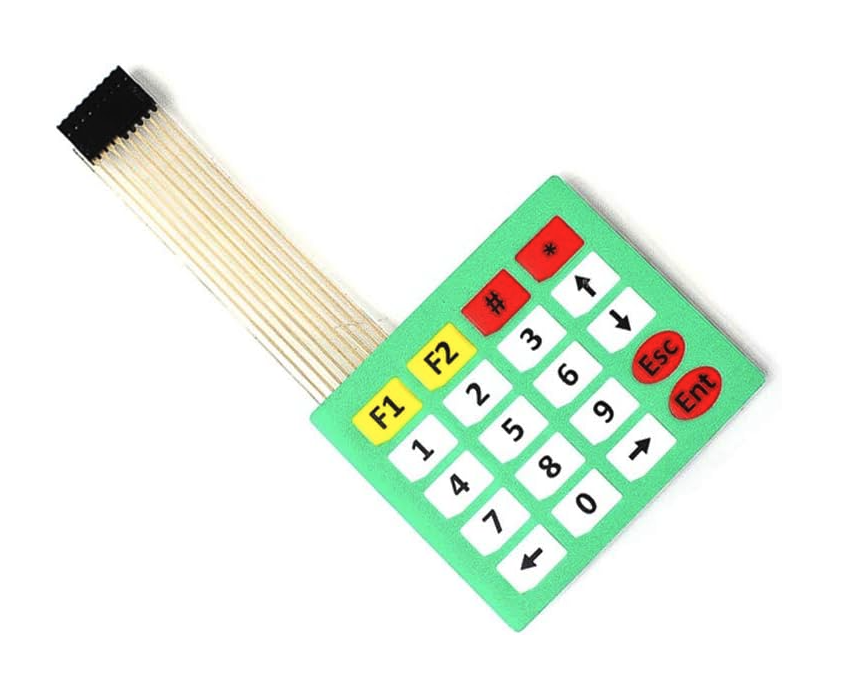
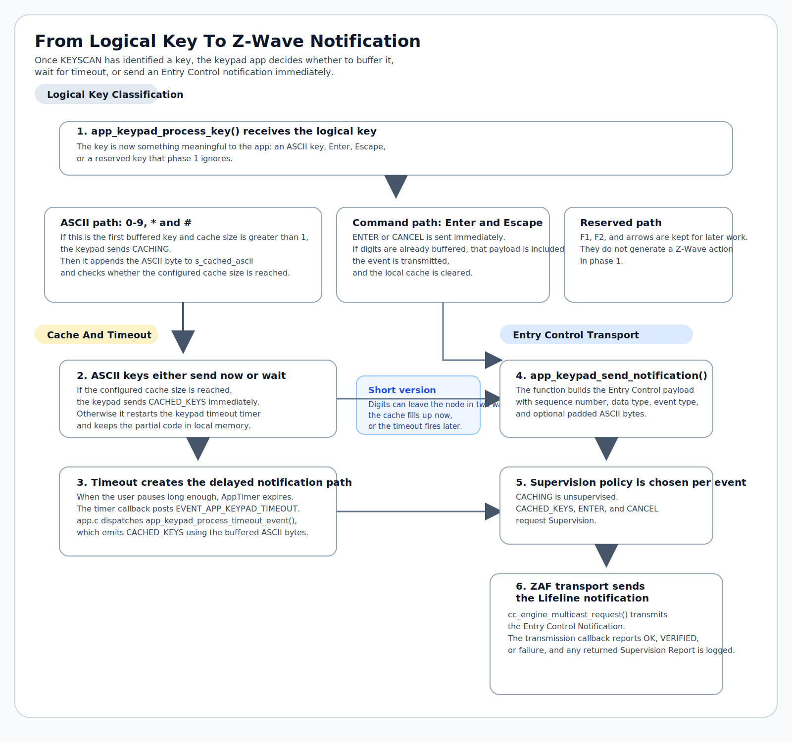
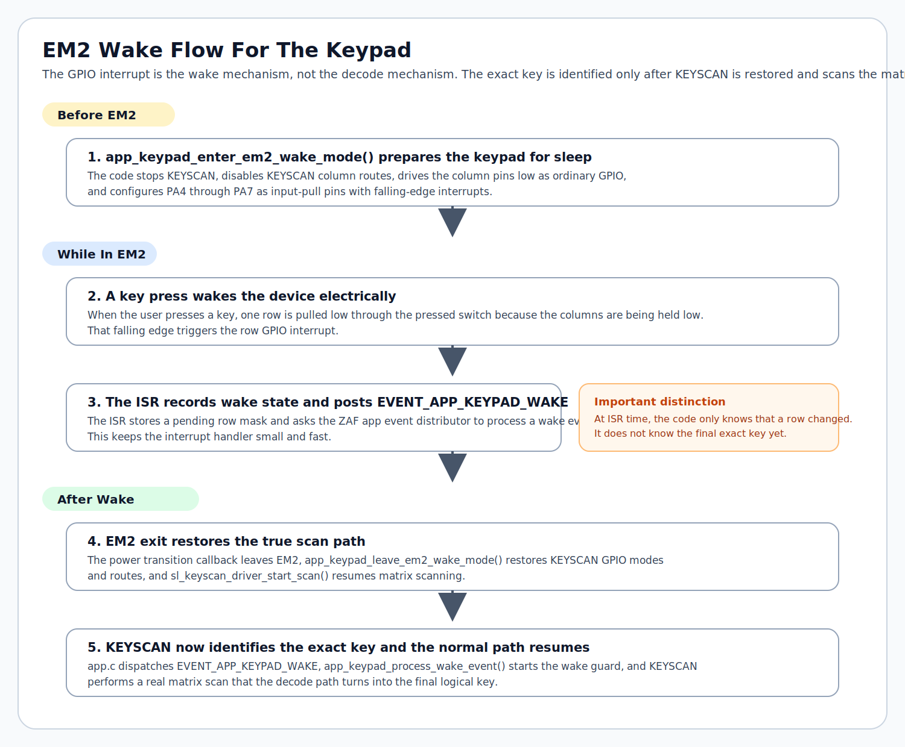

# Z-Wave Keypad Proof of Concept:

Who: Mark Umina 
When: Friday, March 20, 2026 
What: Simplicity SDK Suite v2025.12.1, Z-Wave SDK 8.0.0 
Why: Create a FLiRS keypad proof of concept from DoorLockKeypad application

This repository captures the conversion of the Silicon Labs `ZWave_SoC_DoorLockKeypad_Solution` sample into a Z-Wave keypad proof of concept built around `COMMAND_CLASS_ENTRY_CONTROL`.

## Overview

The project is derived from the Silicon Labs door-lock keypad sample, but it is now modeled as a secure keypad rather than a lock. Lock, and credential-specific behavior was removed because it is not part of the keypad device model used here.

The `COMMAND_CLASS_ENTRY_CONTROL` implementation in this project was written from the Z-Wave Alliance Application Specification PDF `zwave specifications_3828_1.pdf`, using the Entry Control Command Class section as the primary reference.

Current implementation:

- Node type changed to Entry Control / Secure Keypad
- Entry Control command handling was written from the Alliance specification
- keypad input is cached locally and reported through Entry Control notifications
- controller-relevant keypad notifications request Supervision for verified delivery
- Keypad configuration is stored in NVM
- CLI simulation is available for pre-hardware validation
- KEYSCAN support and the EM2 wake handoff are integrated for hardware testing
- The direct WSTK pushbuttons are kept for service actions; no separate pushbutton board is used on the EXP header

## Device Model

- Base sample: `zwave_soc_door_lock_keypad`
- Generic type: `GENERIC_TYPE_ENTRY_CONTROL`
- Specific type: `SPECIFIC_TYPE_SECURE_KEYPAD`
- User icon: `ICON_TYPE_SPECIFIC_ENTRY_CONTROL_KEYPAD_0_9`
- Installer icon: `ICON_TYPE_SPECIFIC_ENTRY_CONTROL_KEYPAD_0_9`
- Requested security: `S2 Access Control`
- Primary command class: `COMMAND_CLASS_ENTRY_CONTROL`
- Supporting command classes kept: `Indicator`, `Battery`, `Association`, `Supervision`, `Version`, `Manufacturer Specific`, `Z-Wave Plus Info`

## Removed Command Classes

| Command Class | Reason |
| --- | --- |
| `Door Lock CC` | Removed because this project is modeled as a keypad, not a lock actuator. |
| `User Code CC` | Removed because local code validation is not part of this keypad implementation. |
| `User Credential CC` | Removed because credential storage and management are not part of this keypad implementation. |
| `Basic CC` | Removed because it does not map cleanly to a secure Entry Control keypad. |

The original sample kept `Basic` because it was still a door-lock product and mapped `Basic` to Door Lock Operation. That behavior was removed along with the lock model.

## External Keypad Reference

The external keypad used for this proof of concept is the 20-key 4x5 membrane keypad shown in the Amazon listing below:

- Amazon reference: <https://www.amazon.com/dp/B07QH6JB23>
- Product family: generic `4x5` / `20-key` membrane matrix keypad
- Cable: linear `1x9`, `0.1 in` pitch tail

Keypad reference image:

Measured keypad tail pinout used in this project:

- Tail pin numbering is left-to-right with `pin 1` at the top-left of the keypad above `F1`
- Tail pins `1-4` form the `4`-line group
- Tail pins `5-9` form the `5`-line group

Measured switch closures:

| Key | Pins |
| --- | --- |
| `F1` | `1-9` |
| `1` | `1-8` |
| `4` | `1-7` |
| `7` | `1-6` |
| `Left` | `1-5` |
| `F2` | `2-9` |
| `2` | `2-8` |
| `5` | `2-7` |
| `8` | `2-6` |
| `0` | `2-5` |
| `#` | `3-9` |
| `3` | `3-8` |
| `6` | `3-7` |
| `9` | `3-6` |
| `Right` | `3-5` |
| `*` | `4-9` |
| `Up` | `4-8` |
| `Down` | `4-7` |
| `Esc` | `4-6` |
| `Ent` | `4-5` |

## WSTK Buttons

This project uses the pushbuttons built directly into the `BRD4002A-A07` Wireless Starter Kit mainboard. It does not use an external button board on the expansion header.

Current WSTK button behavior:

| Button | Press Type | Action |
| --- | --- | --- |
| `BTN0` | Medium press | Send Battery Report |
| `BTN1` | Short press | Toggle Z-Wave learn mode |
| `BTN1` | Very long press | Factory reset |

`BTN0` short and long press are currently unused in this keypad project. The WSTK buttons remain useful for inclusion, exclusion, reset, and testing while the external keypad provides the actual Entry Control input path.

## Entry Control Behavior

The keypad caches input locally and reports it through Entry Control notifications.

Implementation reference:

- Z-Wave Alliance Application Specification: `zwave specifications_3828_1.pdf`
- The Entry Control Command Class behavior in this project was written from that specification

- `Key Cache Size = 1` is valid if per-key reporting is desired.
- Current default: `Key Cache Size = 4`, `Key Cache Timeout = 2 seconds`
- A larger cache such as `32` with a `2` second timeout is a valid configuration for "enter digits, then press Enter" behavior.

Implemented Entry Control support:

- `ENTRY_CONTROL_KEY_SUPPORTED_GET/REPORT`
- `ENTRY_CONTROL_EVENT_SUPPORTED_GET/REPORT`
- `ENTRY_CONTROL_CONFIGURATION_GET/SET/REPORT`
- Lifeline notifications for `CACHING`, `CACHED_KEYS`, `ENTER`, and `CANCEL`

### Selected Key Mapping

This project is based on a 20-key membrane keypad with digits, `*`, `#`, `F1`, `F2`, `Esc`, `Ent`, and arrow keys.

| Key Type | Mapping |
| --- | --- |
| Buffered ASCII keys | `0-9`, `*`, `#` |
| Command keys | `Ent -> ENTER`, `Esc -> CANCEL` |
| Reserved for later | `F1`, `F2`, `Up`, `Down`, `Left`, `Right` |

Phase-1 supported Entry Control events:

- `CACHING`
- `CACHED_KEYS`
- `ENTER`
- `CANCEL`

### Flow Charts

These diagrams tell the story in layers:

- the membrane switch only creates an electrical short between one row and one column
- `KEYSCAN` turns that short into a matrix position
- the keypad app turns that matrix position into a logical key, local cache behavior, and a Z-Wave notification
- static SVGs are used in the README for compatibility, while editable Mermaid source files live in [zwave_soc_keypad/docs/diagrams/README.md](/Users/maumina/Documents/keypad_solution_poc/zwave_soc_keypad/docs/diagrams/README.md)

#### From Physical Key Press To Logical Key

What matters here is that `KEYSCAN` is the part that actually identifies the key. The membrane keypad itself does not "know" about digits or arrows; it only creates a row/column closure, and the decode step in `app_keypad_try_decode_matrix_key()` turns that into `1`, `2`, `Enter`, `Escape`, and so on.

#### From Logical Key To Z-Wave Notification

The timeout-driven notification path works as follows:

1. digits are buffered locally
2. the timer is restarted after each partial entry
3. if the user pauses long enough, the timer callback posts `EVENT_APP_KEYPAD_TIMEOUT`
4. that event runs `app_keypad_process_timeout_event()`
5. the buffered digits are emitted as `CACHED_KEYS` over Z-Wave

`Enter` and `Escape` take the shorter path: they generate `ENTER` or `CANCEL` immediately, include the buffered ASCII if any is present, and then clear the local cache.

### Notification Transport / Supervision

- `CACHED_KEYS`, `ENTER`, and `CANCEL` request Supervision on outbound Entry Control notifications.
- `CACHING` remains unsupervised because it is transient and may repeat during active entry.
- The keypad treats `TRANSMIT_COMPLETE_VERIFIED` as a successful verified send and logs returned Supervision report status when available.

Bitmask note for `Entry Control Key Supported Report`:

- bit `35` = `#`
- bit `42` = `*`
- bits `48` through `57` = `0` through `9`

## Hardware Plan

A `4x5` keypad requires `9` signals total. For this keypad tail, the `4`-line side (`pins 1-4`) is used as `ROW_SENSE`, and the `5`-line side (`pins 5-9`) is used as `COL_OUT`.

- KEYSCAN rows: `4`
- KEYSCAN columns: `5`
- For this keypad tail, pins `1-4` are assigned to `ROW_SENSE`
- For this keypad tail, pins `5-9` are assigned to `COL_OUT`

The harness uses the large `BRD4002A` breakout headers for the `4` row signals and `4` of the `5` column signals, plus `EXP10` for the remaining column signal.

Board constraints:

- The `BRD4210A` radio board breaks out all `EFR32ZG23` GPIO except `PD0` and `PD1`.
- The keypad tail is a straight `1x9` connector, but there is no single straight `1x9` row of usable, non-conflicting GPIO on the breakout headers.
- This pinout avoids conflicts with `VCOM`, `SWD`, the WSTK buttons, the MX25 flash helper, and `PC9` board-control display ownership.

### Harness Wiring

| Keypad Tail Pin | Keys On That Tail Line | Physical Connection |
| --- | --- | --- |
| `1` | `F1`, `1`, `4`, `7`, `Left` | `P41` breakout pad |
| `2` | `F2`, `2`, `5`, `8`, `0` | `P43` breakout pad |
| `3` | `#`, `3`, `6`, `9`, `Right` | `P44` breakout pad |
| `4` | `*`, `Up`, `Down`, `Esc`, `Ent` | `P45` breakout pad |
| `5` | `Left`, `0`, `Right`, `Ent` | `EXP10` on the small `EXP` header |
| `6` | `7`, `8`, `9`, `Esc` | `P24` breakout pad |
| `7` | `4`, `5`, `6`, `Down` | `P25` breakout pad |
| `8` | `1`, `2`, `3`, `Up` | `P31` breakout pad |
| `9` | `F1`, `F2`, `#`, `*` | `P33` breakout pad |

The keypad tail is a linear `1x9` connector. For this README, `pin 1` is the leftmost tail conductor when viewing the keypad from the front, with the tail exiting from the upper-left side of the keypad.

Physical column order note:

- Use the accessible column-pad order `EXP10`, `P24`, `P25`, `P31`, `P33`.
- The `COL_OUT_x` numbering shown later in the Pin Tool section reflects the generated Simplicity configuration and should not be used to infer the left-to-right keypad-tail solder order.

Electrical note:

- The pressed key contact resistance measured on the keypad is low enough for reliable operation with this `KEYSCAN` wiring.

This harness preserves:

- `VCOM_ENABLE` on `PB0`
- `VCOM_RTS` on `PA0`
- `VCOM_TX` on `PA8`
- `VCOM_RX` on `PA9`
- `VCOM_CTS` on `PA10`
- SWD on `PA1` / `PA2`
- `BTN0` on `PB1`
- `LED0` on `PB2`
- `BTN1` on `PB3`
- MX25 flash helper on `PC1`, `PC2`, `PC3`, and `PC4`
- Board-control display ownership on `PC9`

This harness repurposes:

- JTAG / trace-related signals on `PA4` through `PA7`
- PTI signals on `PD4` and `PD5`
- Display signals on `PC8` and `PC6`
- Expansion USART chip-select on `PC0`

### EM2 Wake Strategy

`EFR32ZG23` low-energy GPIO behavior matters here:

- Ports `A` and `B` are EM2-capable GPIO.
- Ports `C` and `D` are retained / latched through EM2.
- `KEYSCAN` itself supports wake-on-keypress down to `EM3`.

With `VCOM`, `SWD`, and the WSTK buttons preserved, there are only `6` free `A/B` GPIO left on this board:

- `PA3`
- `PA4`
- `PA5`
- `PA6`
- `PA7`
- `PB2`

That is not enough to place all `9` keypad lines on `A/B` pins. Because of that, there is no free, non-conflicting `9`-wire harness that keeps every keypad signal on EM2-capable pads while also preserving `VCOM`, `SWD`, and the WSTK buttons.

The low-energy approach is:

1. Use the `A`-port row pins (`PA4` through `PA7`) as the wake-detect lines.
2. Before entering EM2, temporarily drive the column pins (`PD5`, `PD4`, `PC8`, `PC6`, `PC0`) low as normal GPIO outputs.
3. Configure the row pins as `input pull-up` GPIO with falling-edge interrupts.
4. Any key press will pull one row low and wake the device.
5. After wake, restore all `9` pins to `KEYSCAN` routing and scan the matrix to determine the exact key.

This keeps exact key detection available after wake while preserving the kit functions listed above.

#### EM2 Wake Flow

The important distinction is that the row interrupt is only the wake mechanism. The exact key is identified later, after the chip wakes, restores `KEYSCAN`, and the `KEYSCAN` driver performs a real matrix scan again.

### KEYSCAN Configuration

- `SL_KEYSCAN_DRIVER_COLUMN_NUMBER = 5`
- `SL_KEYSCAN_DRIVER_ROW_NUMBER = 4`
- `ROW_SENSE_0 = PA4`
- `ROW_SENSE_1 = PA5`
- `ROW_SENSE_2 = PA6`
- `ROW_SENSE_3 = PA7`
- `COL_OUT_0 = PD5`
- `COL_OUT_1 = PD4`
- `COL_OUT_2 = PC8`
- `COL_OUT_3 = PC6`
- `COL_OUT_4 = PC0`

### Manual Pin Tool Checklist

Set this routing in Simplicity Studio. Do not hand-edit the `.pintool` file.

Keep these assignments as they are:

- `VCOM` on `PA0`, `PA8`, `PA9`, and `PA10`
- `SWV` on `PA3`
- `BTN0` on `PB1`
- `LED0` on `PB2`
- `BTN1` on `PB3`
- `LED1` on `PD3`
- MX25 flash helper on `PC1`, `PC2`, `PC3`, and `PC4`
- Board-control display ownership on `PC9`

Set `KEYSCAN` to:

- `ROW_SENSE_0 = PA4`
- `ROW_SENSE_1 = PA5`
- `ROW_SENSE_2 = PA6`
- `ROW_SENSE_3 = PA7`
- `COL_OUT_0 = PD5`
- `COL_OUT_1 = PD4`
- `COL_OUT_2 = PC8`
- `COL_OUT_3 = PC6`
- `COL_OUT_4 = PC0`

Active KEYSCAN GPIO behavior is already handled by the Silicon Labs driver:

- `COL_OUT_x` pins are configured as `wired-and` outputs with default value `1`
- `ROW_SENSE_x` pins are configured as `input pull-up`

Active KEYSCAN interrupts already used by the driver:

- `KEYSCAN_IF_WAKEUP`
- `KEYSCAN_IF_KEY`
- `KEYSCAN_IF_NOKEY`
- `KEYSCAN_IF_SCANNED`

The additional falling-edge GPIO interrupts on `PA4` through `PA7` are part of the EM2 sleep / wake handoff that is already in the source, not part of the normal KEYSCAN pin-tool routing.

## Validation

The most useful pre-hardware validation is controller `GET` and `REPORT` traffic.

Recommended checks:

- `Entry Control Key Supported Get`
  - expect `#`, `*`, and `0-9`
- `Entry Control Event Supported Get`
  - expect `CACHING`, `CACHED_KEYS`, `ENTER`, and `CANCEL`
- `Entry Control Configuration Get`
  - expect the configured cache size and timeout
- `Entry Control Configuration Set`
  - verify the node accepts valid values and returns them through `Configuration Get`
- supervised outbound notifications
  - expect `CACHED_KEYS`, `ENTER`, and `CANCEL` to request Supervision
  - expect `CACHING` to remain unsupervised
  - expect verified sends to surface as `TRANSMIT_COMPLETE_VERIFIED` and Supervision report logs when the controller returns them

The accessible column order is `EXP10`, `P24`, `P25`, `P31`, `P33`. The EM2 wake handoff and real `KEYSCAN` matrix-to-logical-key decode path are integrated in the source.

## Project Status Summary

This checklist summarizes the implemented work and completed validation.

- [x] Created this keypad PoC from the current Silicon Labs `ZWave_SoC_DoorLockKeypad_Solution` sample, keeping the FLiRS framework, build flow, and WSTK service-button behavior as the project foundation.
- [x] Wrote the Entry Control implementation from the Z-Wave Alliance Application Specification PDF `zwave specifications_3828_1.pdf`.
- [x] Changed the device model to `GENERIC_TYPE_ENTRY_CONTROL` / `SPECIFIC_TYPE_SECURE_KEYPAD` and updated the keypad icons.
- [x] Removed `Door Lock CC`, `User Code CC`, `User Credential CC`, and `Basic CC`.
- [x] Kept the direct WSTK buttons for service actions such as learn mode, battery report, and factory reset.
- [x] Added keypad caching, Entry Control notifications, and NVM-backed Entry Control configuration handling.
- [x] Enabled selective Supervision for controller-relevant Entry Control notifications.
- [x] Added CLI-based keypad simulation for pre-hardware validation.
- [x] Integrated `KEYSCAN` support and the EM2 wake handoff into the project.
- [x] Measured the actual `1x9` keypad tail pinout and documented the keypad harness mapping.
- [x] Confirmed inclusion, exclusion, and initial controller interview behavior.
- [x] Set the `KEYSCAN` routing in Pin Tool and regenerated the project.
- [x] Rebuilt, flashed, and smoke-tested after the Pin Tool routing change.
- [x] Verified the expected matrix-to-logical-key mapping.
- [x] Soldered the keypad harness to `P41`, `P43`, `P44`, `P45`, `P24`, `P25`, `P31`, `P33`, and `EXP10`, and verified continuity on the final assembly.
- [x] Added the real `KEYSCAN` callback path and matrix-to-logical-key translation.
- [x] Exercised the existing EM2 wake handoff and verified the expected row-wake behavior.
- [x] Ran physical keypress testing and verified lifeline notification delivery over Z-Wave.
- [x] Added local user feedback for key accepted, cancel, and transmit failure.
- [x] Re-ran inclusion, interview, configuration, and lifeline-notification tests with the fully connected keypad path.
